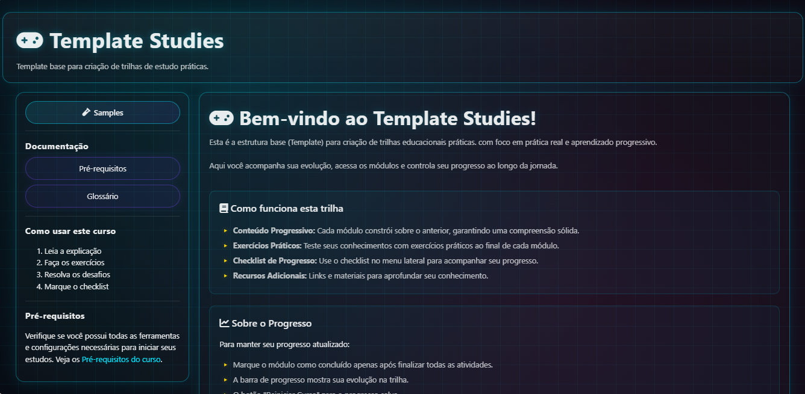

<h1 align="center">Olá, eu sou a Carla! 😊☁️🚀</h1>

  DevOps Engineer | Azure DevOps | CI/CD Automation | DevSecOps

---

## Sobre mim

Sou **DevOps Engineer especializada em Azure DevOps**, focada em construir pipelines eficientes, seguros e altamente automatizados.

Trabalho criando soluções escaláveis e resilientes em ambientes cloud, com forte foco em **CI/CD, automação e DevSecOps**.

Sou apaixonada por tecnologia e por transformar ambientes complexos em pipelines simples, automatizados e seguros.

Também gosto de compartilhar conhecimento com o time através de workshops internos e iniciativas de aprendizado colaborativo, porque acredito que conhecimento só tem valor quando é multiplicado.

Alguns princípios que guiam meu trabalho::

- Gosto de ambientes colaborativos, com foco em melhoria contínua e entrega de valor real
- Acredito que segurança deve ser parte da cultura DevOps e não um “extra”
- Estou sempre em busca de novas formas de otimizar processos e aumentar a eficiência
- Aprendizado nunca para: estou sempre estudando algo novo
- 
---

## 🛠️ Tecnologias & Ferramentas

  <!-- Cloud & Infrastructure -->
  
  
  
  
   

  <!-- DevOps -->
  
  
  
  
  
   

  <!-- Languages & Scripting -->
  
  
  
  
   

  <!-- Platform -->
  
  
  

---

<!-- ## 📚 Atualmente estudando

<

----->

## 📊 GitHub Stats

---

## 📂 Projetos em Destaque

### 📚 Template Studies

🧩 **Problema:** documentação técnica costuma virar conteúdo difícil de navegar e acompanhar.

💡 **Solução:** criei um template open-source para estruturar trilhas técnicas com progresso, quizzes e certificados automáticos.

🔗 Repository: https://github.com/carlapvicente/template-studies

Stack      | Eleventy (SSG) • JavaScript • Sass  
Type       | Static Learning Platform  
Focus      | DevOps Education • Technical Learning Paths

Template open-source criado para estruturar **trilhas de estudo técnicas e laboratórios práticos** de forma interativa e leve.

A plataforma permite organizar conteúdos progressivos para áreas como **Linux, Cloud e DevOps**, mantendo performance e simplicidade através de uma arquitetura totalmente estática.

### Highlights

- ✅ Progresso do aluno salvo via **Local Storage**
- 🏆 Sistema de **quizzes e desafios**
- 📜 **Geração automática de certificados em PDF**
- 🎨 **Design System customizável**

### 🐧 Linux IaC Automation

🧩 **Problema:** configurar usuários, grupos e permissões manualmente em Linux é repetitivo e propenso a erro.

💡 **Solução:** desenvolvi um script automatizado que provisiona estrutura completa de usuários, grupos e permissões com segurança.

🔗 Repository: https://github.com/carlapvicente/linux-fundamentals-dio

Stack      | Bash • Linux • System Administration  
Type       | Infrastructure Automation Script  
Focus      | Secure provisioning of users and permissions

Script desenvolvido para **automatizar o provisionamento de usuários, grupos e diretórios em ambientes Linux**, aplicando boas práticas de segurança e administração de sistemas.

### Highlights

- 🛡️ Implementação automatizada de **SGID** e **Sticky Bit**
- 📝 **Auditoria em tempo real** via logs com `tee`
- ⚙️ Código modular com validação de root
- 📚 Documentação completa com demonstração de execução
---

## ✨ Em breve

- Experimentos com ferramentas como Terraform e Docker
- Scripts e utilitários desenvolvidos em PowerShell e Python

---

## 🤝 Vamos nos conectar?

  
Sinta-se à vontade para abrir uma issue ou me chamar no LinkedIn. Quem sabe a gente não constrói algo incrível juntas(os)?

  

